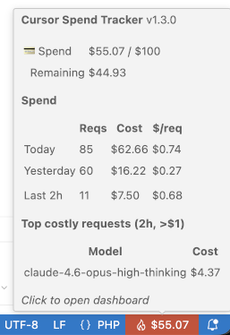

# Cursor Spend Tracker

[](https://github.com/maurice2k/cursor-spend-tracker/actions)
[](https://opensource.org/licenses/MIT)
[](https://code.visualstudio.com/)

A VS Code extension that displays your Cursor on-demand spending in the status bar.

## Features

- 💰 **Real-time Spending Display** - See your Cursor on-demand costs right in the status bar
- 📊 **Daily Statistics** - View today's, yesterday's, and last 2 hours usage in the tooltip
- ⚡ **Included Quota Tracking** - Monitor your included request quota usage
- 🔔 **Alerts for Expensive Requests** - Visual alerts when you make expensive requests (>$2)
- 🔄 **Auto-refresh** - Configurable refresh interval (default: 5 minutes)

## Installation

1. Download the latest `.vsix` file from the [releases page](https://github.com/maurice2k/cursor-spend-tracker/releases)
2. Open VS Code and go to Extensions (Ctrl+Shift+X)
3. Click the three dots menu (...) → "Install from VSIX..."
4. Select the downloaded `.vsix` file

> **Note:** This extension only works in the [Cursor](https://cursor.com/) editor, not in standard VS Code.

## Usage

After installation, the extension automatically shows your current spend in the status bar:

- **💳 `$X.XX`** - Shows on-demand spending
- **⚡ `X/Y`** - Shows included quota usage when no on-demand spend
- **🔥 `$X.XX`** - Alert mode for recently expensive requests

### Commands

| Command | Description |
|--------|-------------|
| `Cursor Spend: Refresh Now` | Manually refresh the usage data |
| `Cursor Spend: Open Dashboard` | Open the Cursor usage dashboard |

### Configuration

| Setting | Default | Description |
|--------|---------|-------------|
| `cursorSpendTracker.refreshIntervalSeconds` | `300` | How often to refresh usage data (in seconds) |

## Preview



## Tooltip

The status bar tooltip displays detailed usage information:

| Column | Description |
|--------|-------------|
| **Spend** | Your on-demand usage and remaining balance |
| **Included** | Your included request quota |
| **Today** | Number of requests, total cost, and average cost per request for today |
| **Yesterday** | Same metrics for yesterday |
| **Last 2h** | Spending statistics for the last 2 hours |

## Requirements

- Cursor editor with active session
- VS Code 1.85.0 or higher
- Node.js (for building from source)
- sqlite3 CLI tool (for reading Cursor session token)

## Development

### Prerequisites

- Node.js 18+
- npm
- TypeScript
- sqlite3 command-line tool

### Setup

```bash
# Install dependencies
npm install

# Compile the extension
npm run compile

# Watch mode (auto-compile on changes)
npm run watch
```

### Packaging

```bash
# Install vsce (VS Code Extension Manager)
npm install -g @vscode/vsce

# Package the extension
vsce package
```

## Contributing

Contributions are welcome! Please feel free to submit a Pull Request.

1. Fork the repository
2. Create your feature branch (`git checkout -b feature/amazing-feature`)
3. Commit your changes (`git commit -m 'Add some amazing feature'`)
4. Push to the branch (`git push origin feature/amazing-feature`)
5. Open a Pull Request


## License

MIT License - see [LICENSE](LICENSE) file for details.

*Cursor is a registered trademark of Anysphere, Inc. This extension is not affiliated with, sponsored, or endorsed by Anysphere, Inc.*
